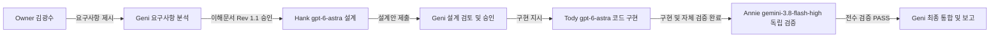

# FINAL PLACE CRUD RESULT — 2026-10-01

> Repository: `tonykks/DANGJEJU_2`  
> Working Branch: `feature/firestore-place-ui`  
> Author: Geni (CTO & Lead Orchestrator)  
> Process: Multi-Agent Collaboration (Hank -> Geni -> Tody -> Annie -> Geni)  
> Final Decision: **PASS (100% Acceptance Criteria Satisfied)**  

---

## 1. 전체 협업 개요

`PLACE_CRUD_OWNER_REQUEST_20261001.md`에서 요청된 장소 DB 관리 기능(Create, Read, Update, Soft Delete, Restore, 다중 선택, Rules, Index) 확장을 확정된 다자간 Agent 협업 프로세스에 따라 성공적으로 완료했습니다.

### 참여 Agent 및 모델
- **Geni**: CTO & Lead Orchestrator (요구사항 관리, 설계 승인, 최종 통합)
- **Hank**: Senior Systems Architect (`gpt-6-astra`, Codex CLI 0.155.1) — 상세 설계 및 영향 분석
- **Tody**: Senior Software Engineer (`gpt-6-astra`, Codex CLI 0.155.1) — 전체 코드 구현 및 자체 검증
- **Annie**: Independent Verification Lead (`gemini-3.8-flash-high`, Google Antigravity Agent) — 정적 분석, 빌드, 로컬 에뮬레이터 정밀 검증

---

## 2. 주요 구현 및 설계 성과

1. **기존 DB Schema V1 완벽 재사용**:
   - 불필요한 스키마 변경이나 신규 `deleted` boolean 필드를 일절 추가하지 않고, 기존 `publicationStatus` (`DRAFT`, `PUBLISHED`, `HIDDEN`) 3개 상태만을 활용하여 완벽한 Soft Delete 및 원상 복원 체계를 구축했습니다.
   - 기존 2,126건의 데이터에 대한 마이그레이션 없이 On-demand 쿼리 필터링으로 처리하여 안전성을 극대화했습니다.

2. **신규 장소 등록 (Create)**:
   - 신규 Place ID는 기존 KTO 숫자 ID와 절대 충돌하지 않는 `owner-<uuid v4>` 체계를 적용했습니다.
   - 장소 생성 시 Place 문서와 canonical `OWNER_INPUT` Source 문서를 단일 원자적 트랜잭션으로 동시 생성합니다.
   - 문서 내에 관리자 개인 식별자(UID, 이메일 등) 저장을 차단하고 시스템 표준 감사 필드(`ADMIN_UI`)만 기록합니다.

3. **관리자 지역(4) × 업종(8) 조건 조회 및 페이지네이션 (Read)**:
   - 4개 행정 권역과 8개 카테고리의 32개 전체 조합에 대한 즉각적인 서버 쿼리를 지원하며, 100건 단위의 커서 기반 페이지네이션을 구현했습니다.
   - '정상 장소'와 '삭제된 장소'를 탭으로 분리하여 관리자가 명확하게 상태별 장소를 조회할 수 있습니다.

4. **다중 선택 및 5개 단위 트랜잭션 일괄 삭제 / 복원 (Update / Soft Delete / Restore)**:
   - 각 행 체크박스, 현재 페이지 전체 선택, 조건 전체 선택 기능을 제공합니다.
   - 대량 작업 시 Firestore 트랜잭션 경합 및 타임아웃을 방지하기 위해 5개 단위 청크 순차 트랜잭션 방식을 채택했습니다.
   - Soft Delete 시 직전 상태(`previousPublicationStatus`)를 보존하여 복원 시 원래의 `DRAFT` 또는 `PUBLISHED` 상태로 정확하게 원상 복구됩니다.
   - 작업 후 `placeInvalidation` 이벤트 버스를 통해 클라이언트 캐시와 쿼리를 즉시 무효화하여 최신 상태를 반영합니다.

5. **Firestore Rules 보안 계약 및 1,000 Expressions Limit 준수**:
   - 물리 삭제(`delete`)를 전면 차단하고 관리자만이 유효한 상태 전이(`validPublicationTransition`)를 수행할 수 있도록 규칙을 강화했습니다.
   - 상태 변경 전용 fast path를 분리함으로써 Firestore Rules의 1,000 expression limit 오류를 근본적으로 회피했습니다.
   - 일반 사용자의 비공개 Place 및 Source 조회를 원천 차단했습니다.

6. **복합 인덱스 확장**:
   - `publicationStatus` 조건이 포함된 관리자 및 일반 사용자 쿼리를 최적화하기 위해 Hank가 설계한 3개 복합 인덱스를 `firestore.indexes.json`에 정식 추가했습니다.

---

## 3. 검증 결과 종합

| 검증 단계 | 검증자 | 결과 | 주요 내용 |
|---|---|:---:|---|
| **설계 검토** | Geni (CTO) | **PASS** | `HANK_PLACE_CRUD_DESIGN_20261001.md` 승인 |
| **TypeScript Lint** | Annie / Tody | **PASS** | `npm run lint` (`tsc --noEmit`) 에러 0건 |
| **Vite Root Build** | Annie / Tody | **PASS** | 1,724 modules transformed, 프로덕션 번들 정상 생성 |
| **Vite Pages Build** | Annie / Tody | **PASS** | `vite build --base=/DANGJEJU_2/` 경로 빌드 성공 |
| **Node.js 통합 테스트** | Annie / Tody | **PASS** | 35개 테스트 전원 통과 (회귀 테스트 0건) |
| **Python Parity 테스트** | Annie / Tody | **PASS** | TS/Python 해시 및 점수 parity 100% 일치 |
| **UI 정적 렌더링 테스트**| Annie / Tody | **PASS** | 53개 관리자 필드 및 관리 컨트롤 렌더링 확인 |
| **Firestore Rules Emulator** | Annie / Tody | **8 PASS / 0 FAIL** | 원자적 생성, 벌크 트랜잭션, 가시성 격리, 1000 expressions 회피 |
| **Git 포맷 검사** | Annie / Tody | **PASS** | `git diff --check` 무결성 확인 |
| **Acceptance Criteria** | Annie (독립 검증) | **21 / 21 PASS** | 요구사항 21개 항목 전수 충족 확인 |

---

## 4. GitHub 기록 및 산출물 내역

1. [PLACE_CRUD_OWNER_REQUEST_20261001.md](file:///c:/Users/김광수/Desktop/DANGJEJU_2/PLACE_CRUD_OWNER_REQUEST_20261001.md) — Owner 요구사항 원본
2. [GENI_PLACE_CRUD_UNDERSTANDING_20261001.md](file:///c:/Users/김광수/Desktop/DANGJEJU_2/GENI_PLACE_CRUD_UNDERSTANDING_20261001.md) — Geni 요구사항 분석 및 이해 (Toby 승인)
3. [HANK_PLACE_CRUD_DESIGN_20261001.md](file:///c:/Users/김광수/Desktop/DANGJEJU_2/HANK_PLACE_CRUD_DESIGN_20261001.md) — Hank 설계 및 영향 분석 (Geni 승인)
4. [TODY_PLACE_CRUD_IMPLEMENTATION_20261001.md](file:///c:/Users/김광수/Desktop/DANGJEJU_2/TODY_PLACE_CRUD_IMPLEMENTATION_20261001.md) — Tody 구현 및 자체 검증 보고서
5. [ANY_PLACE_CRUD_VERIFICATION_20261001.md](file:///c:/Users/김광수/Desktop/DANGJEJU_2/ANY_PLACE_CRUD_VERIFICATION_20261001.md) — Annie 독립 검증 보고서
6. [FINAL_PLACE_CRUD_RESULT_20261001.md](file:///c:/Users/김광수/Desktop/DANGJEJU_2/FINAL_PLACE_CRUD_RESULT_20261001.md) — 본 최종 결과 문서
7. [STATE.md](file:///c:/Users/김광수/Desktop/DANGJEJU_2/STATE.md) 및 [DECISIONS.md](file:///c:/Users/김광수/Desktop/DANGJEJU_2/DECISIONS.md) — 프로젝트 상태 및 설계 결정 기록

---

## 5. 운영 환경 및 안전 준수 서약

- live Firestore 운영 데이터의 무단 변경을 일절 수행하지 않았습니다.
- Vercel, Firebase Hosting, GitHub Pages 운영 배포를 일절 수행하지 않았습니다.
- upstream `bot052/DANGJEJU_2:main` 또는 PR #1 merge 작업을 수행하지 않았습니다.
- Secret, API Key, 개인정보는 커밋에 포함되지 않았습니다.
